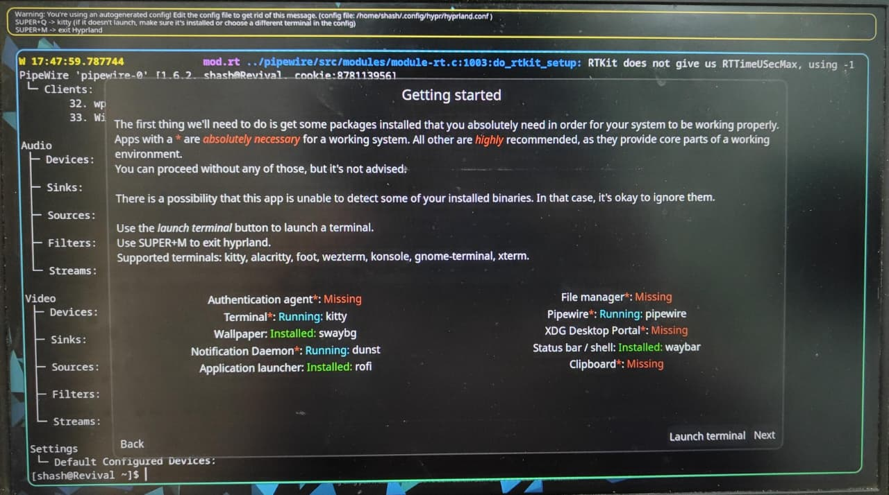
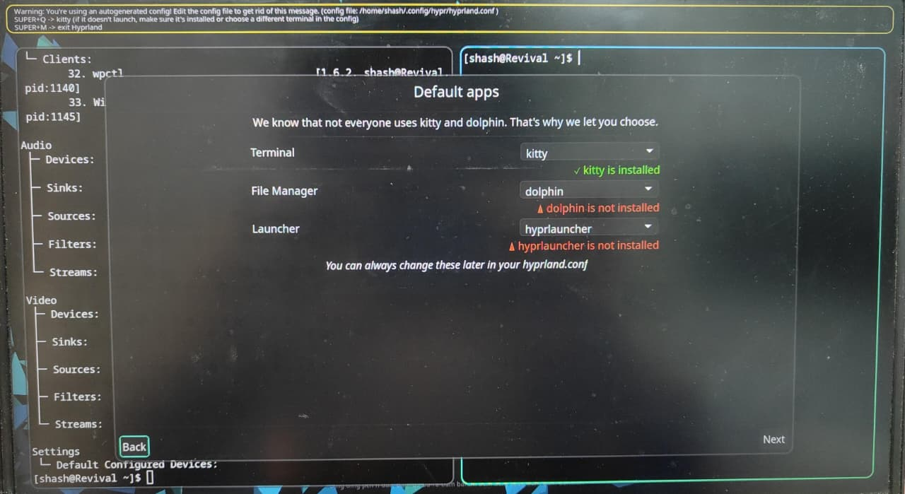
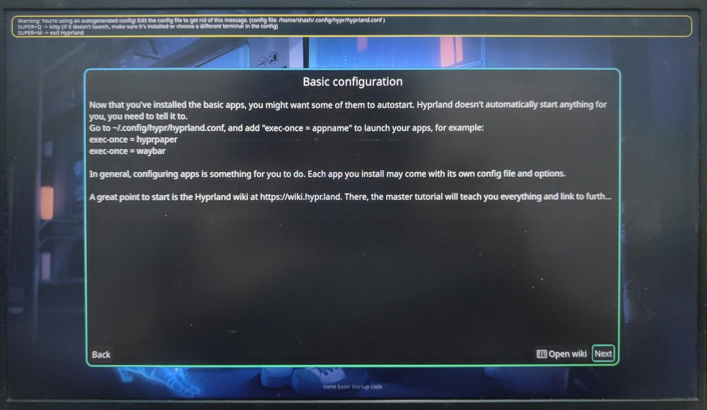
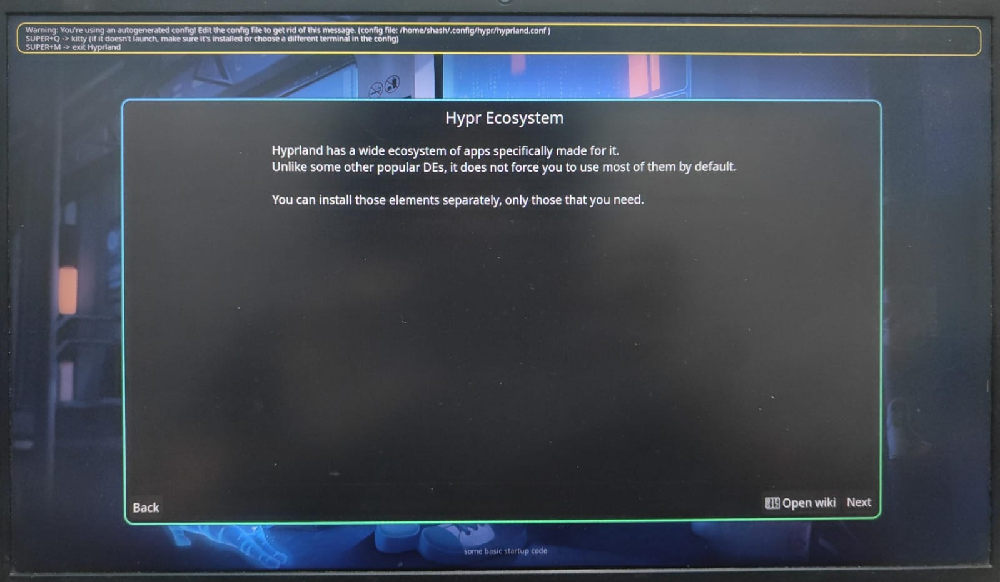
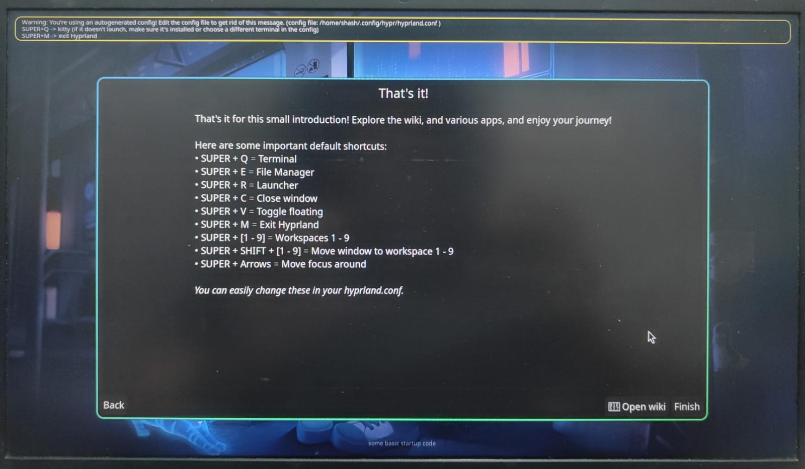

# Hyprland Configuration & Customization

Welcome to the fun part! You now have a working graphical environment. However, because Hyprland is a "Window Manager" (and not a full pre-packaged desktop like Windows or macOS), **everything** about how it looks and behaves is controlled by a single text file.

This document will guide you through making your desktop actually look beautiful and functional.

---

## 1. First Launch: The "Getting Started" Wizard

When you boot into Hyprland for the very first time, you may be greeted by a graphical "Getting started" setup wizard running inside your terminal. It checks your system for core capabilities like file managers, clipboards, and status bars.



This wizard shows heavily recommended tools and detects missing ones. Let's break down the components it is asking for and explain the options.

### What We Already Installed (and Why)

You will see several items marked in **green** (Installed). We intentionally chose these packages during the GUI installation phase:

1. **Terminal (`kitty`)**:
   - *Why we chose it:* Kitty is an incredibly fast, highly customizable, GPU-accelerated terminal emulator. It can even render images and graphs directly inside the terminal window.
   - *Alternatives:* `alacritty` (faster but lacks some advanced image-rendering features), `wezterm` (very powerful, configured via Lua), `konsole` (KDE's default, good but heavier).
2. **Wallpaper (`hyprpaper`)**:
   - *Why we chose it:* Developed directly by the Hyprland team, `hyprpaper` offers native integration, excellent IPC support (allowing you to change wallpapers instantly via command line), and distinct wallpapers per monitor.
   - *Alternatives:* `swaybg` (older, more basic but extremely lightweight), `wpaperd`, or `mpvpaper` (for animated video wallpapers).
3. **Status bar / shell (`hyprpanel`)**:
   - *Why we chose it:* Instead of just a bar, `hyprpanel` is a cohesive ecosystem panel. It beautifully integrates a top bar, a sleek OSD (on-screen display for volume/brightness), and unified control widgets out of the box, looking phenomenal natively on Hyprland.
   - *Alternatives:* `waybar` (the standard customizable choice using CSS), `eww` (insanely customizable using Lisp-like widgets, but highly complex).
4. **Notification Daemon (`swaync`)**:
   - *Why we chose it:* SwayNotificationCenter (`swaync`) doesn't just pop up alerts; it provides a stunning, slide-out control center panel (like macOS or Windows 11) where you can toggle Wi-Fi, Do Not Disturb, and see past notifications.
   - *Alternatives:* `dunst` (a very lightweight, text-based popup daemon), `mako`.
5. **Application launcher (`rofi-wayland`)**:
   - *Why we chose it:* `rofi -show drun` is mature, lightweight, fast, and easy to script. It is one of the most stable launcher choices on Wayland Hyprland setups.
   - *Alternatives:* `Hyprlauncher`, `wofi`, or `fuzzel`.

*(For detailed video overviews of configuring these tools, search YouTube for "Linux Hyprland Rice" or look up channels like **DistroTube** or **The Linux Cast**).*

### Resolving "Missing" Core Components

You will also notice the wizard highlights several things in **red** (Missing). You need these for a fully functioning desktop.

1. **Authentication Agent (Missing)**
   - *What it does:* When a graphical app needs administrator/root privileges, this provides the secure popup box asking for your password.
   - *The Fix:* We will install and use `hyprpolkitagent`. We chose this because it is the officially developed polkit agent by the Hypr ecosystem, guaranteeing zero legacy X11 or heavy KDE dependencies.
   - *Other options:* `polkit-kde-agent`, `lxsession-polkit` or `gnome-polkit`.
2. **XDG Desktop Portal (Missing)**
   - *What it does:* Absolutely mandatory for modern Linux. It handles secure communication between apps and your system—specifically **screen sharing** (OBS, Discord, WebRTC) and standard **Open/Save File Dialog** menus.
   - *The Fix:* You must install `xdg-desktop-portal-hyprland`. No alternatives here—you need the specific Hyprland portal for screen sharing to work perfectly on this window manager.
3. **Clipboard (Missing)**
   - *What it does:* Manages copy and paste history for Wayland.
   - *The Fix:* Install `wl-clipboard` (the engine responsible for handling copy data) and optionally `cliphist` (a manager that saves a history of your past copied items so you can recall them with a shortcut).

---

## 2. Setting Default Apps (File Managers & Launchers)

If you hit "Next" in the wizard, it will ask you to select Default Apps.



Because a window manager is a "build-it-yourself" desktop, you must choose what app opens when you want to manage files or launch programs.

### File Manager Options

*A File Manager is the app you use to browse your folders (like Windows Explorer or macOS Finder).*

1. **`dolphin`**:
   - *Features:* The default file manager for the KDE Plasma desktop. It is the most feature-rich option available (split screen, heavy plugin support, excellent network drive handling).
   - *Pros/Cons:* Unmatched power, but very "heavy" as it relies on many KDE desktop dependencies.
2. **`thunar`**:
   - *Features:* The default for the XFCE desktop environment.
   - *Pros/Cons:* The perfect balance. It is incredibly fast, extremely lightweight, yet supports advanced features like bulk-renaming and custom right-click actions without needing a heavy desktop environment attached to it.
3. **`nautilus`**:
   - *Features:* The default for the GNOME desktop.
   - *Pros/Cons:* Very clean, minimalist, and touch-screen friendly. However, power users sometimes find it lacking in advanced layout options.
4. **`nemo`**:
   - *Features:* The default for Linux Mint (Cinnamon). It is a fork of an older version of Nautilus.
   - *Pros/Cons:* Retains heavily requested power-user features (like a compact list view and advanced context menus) that standard Nautilus removed.
5. **`pcmanfm`**:
   - *Features:* The default for LXDE/LXQt.
   - *Pros/Cons:* The absolute lightest and fastest file manager in existence. The trade-off is that it looks somewhat dated.

*(Installation Choice: We are proceeding with **Thunar** for a fast and lightweight daily file manager.)*

### Application Launcher Options

*A Launcher is the menu that pops up to search and open apps (similar to hitting the Windows Key).*

1. **`rofi -show drun`** (Our Installation Choice)
   - *Features:* Mature, handles app launching, window switching, and even custom script menus (like a power-off menu). Infinite customization.
   - *Pros/Cons:* Highly flexible via standard CSS, but requires more manual setup to look perfectly native.
2. **`Hyprlauncher`**
   - *Features:* A first-party multipurpose and versatile launcher for Hyprland.
   - *Pros/Cons:* Native integration and straightforward setup, but not required for this guide path.
3. **`wofi`**
   - *Features:* One of the first launchers built explicitly for the Wayland protocol. Very simple, neat GTK-based layout.
   - *Pros/Cons:* Easy to configure using standard CSS, but development has slowed down compared to newer forks.
4. **`fuzzel`**
   - *Features:* Strictly Wayland-native. It is designed to be an extremely fast, lightweight application launcher.
   - *Pros/Cons:* Less visually flashy than Rofi, but blazingly fast if you just want to type an app name and press enter.
5. **`anyrun`**
   - *Features:* Written in Rust. It functions like macOS Spotlight—it's highly modular. You can use it to launch apps, do math calculations (e.g., typing "3+3"), or do direct web searches.
6. **`tofi`**
   - *Features:* A highly minimalist launcher that relies strictly on text rendering directly to the screen. It is extremely fast and very lightweight.

*(Installation Choice: We are proceeding with **Rofi** for launch/search and scriptable workflows).*

---

## 3. Completing the Wizard & Generating Your Config

Assuming you are currently looking at the **"Default apps"** screen (In the image above), follow these steps:

1. Using your arrow keys or mouse, ensure **Terminal** is set to kitty.
2. Set **File Manager** to `thunar`.
3. Set **Launcher** to `rofi -show drun` (or `rofi-wayland` if the wizard asks for package name).
4. Click the **"Next"** button at the bottom right.

### 3.1 Basic Configuration (Autostarting)



Now you will encounter the **Basic configuration** screen. This highlights the most critical rule of configuring Hyprland: **You are in charge of autostarting components.**

According to official Arch Wiki guidelines, it is crucial that you use the correct dispatchers in your config:
- **`exec-once = appname`**: Use this for background daemons (like your wallpaper, polkit agent, and status bar). It guarantees the app launches *exactly once* when you first log in.
- **NEVER use `exec = appname` for services**: `exec` runs the command every single time you save your configuration file or reload Hyprland. This creates multiple duplicate instances, devours memory, and will crash your system.

Click **"Next"**.

### 3.2 The Hypr Ecosystem



The wizard briefly explains the **Hypr Ecosystem**. Unlike bulky desktop environments (like GNOME or KDE) that force a bunch of apps on you, Hyprland lets you install elements separately. This confirms the exact path we took: manually picking tailored, native components like `hyprpaper`, `hyprpanel`, and `hyprpolkitagent` to keep the system lean and optimized.

Click **"Next"**.

### 3.3 Default Shortcuts & Finalizing



The final **"That's it!"** screen gives you a cheat sheet of default keybinds. Because you don't have a taskbar yet, these are mandatory for navigation:
- `SUPER + Q`: Terminal
- `SUPER + E`: File Manager
- `SUPER + M`: Exit Hyprland completely.
- `SUPER + V`: Toggle floating mode for a window.

**Final Steps on the Wizard:**
1. Click the **"Finish"** button at the bottom right.
2. The wizard will officially write your `~/.config/hypr/hyprland.conf` file.
3. Once it closes, you will be deposited into your raw, blank Hyprland session.
4. You will likely see a yellow warning banner at the top of the screen stating: *"Warning: You're using an autogenerated config!"*

Now it is time to open the terminal and complete the missing installations. Press `SUPER + Q` (Windows Key + Q) to open your terminal (kitty).

---

## 4. Installing the Missing Components

Based on the red "Missing" tags from the wizard (Image 3), we will now systematically install each missing piece. We are following official Arch Linux and Hyprland Wiki guidelines.

*Note: We will use the terminal (kitty) for all these installations. Since you are in a live graphical session, you do not need to reboot between these installations—they take effect immediately.*

### 4.1 Authentication Agent (hyprpolkitagent)

We need a polkit agent to allow GUI apps (like partition managers) to ask for root passwords securely. The official Hyprland ecosystem provides its own native polkit agent.

Run:
```Bash
sudo pacman -S hyprpolkitagent
```

(Output example)
```Bash
resolving dependencies...
looking for conflicting packages...

Packages (2) polkit-1.24-1 hyprpolkitagent-0.1.2-1

Total Download Size:   0.45 MiB
Total Installed Size:  1.32 MiB

:: Proceed with installation? [Y/n]
```
*(Press Y and Enter)*

### 4.2 File Manager + TUI Manager (thunar + yazi)

We selected **Thunar** as the GUI file manager and **Yazi** as the terminal file manager.

Run:
```Bash
sudo pacman -S thunar thunar-volman gvfs tumbler file-roller yazi
```

Why these packages:
1. `thunar`: lightweight GUI file manager.
2. `thunar-volman`: removable drives and automount actions.
3. `gvfs`: trash, network mounts, and desktop file operations.
4. `tumbler`: thumbnail support in Thunar.
5. `file-roller`: archive integration for zip/tar actions.
6. `yazi`: fast terminal file manager for keyboard workflows.

### 4.3 XDG Desktop Portal

The XDG Desktop Portal allows apps (like Firefox or OBS) to record your screen or open file-picker menus in Wayland securely. We strictly need the official Hyprland portal.

Run:
```Bash
sudo pacman -S xdg-desktop-portal-hyprland xdg-desktop-portal
```

(Output example)
```Bash
resolving dependencies...
looking for conflicting packages...

Packages (4) sdbus-cpp-1.4.0-1 xdg-desktop-portal-1.18.2-1 xdg-desktop-portal-hyprland-1.3.1-1

Total Download Size:   2.30 MiB
Total Installed Size:  9.60 MiB

:: Proceed with installation? [Y/n]
```
*(Press Y and Enter)*

### 4.4 Clipboard Managers (wl-clipboard & cliphist)

Wayland requires dedicated clipboard engines. wl-clipboard handles the raw copying and pasting (like Ctrl+C), and cliphist remembers your copy history.

Run:
```Bash
sudo pacman -S wl-clipboard cliphist
```

(Output example)
```Bash
resolving dependencies...
looking for conflicting packages...

Packages (2) wl-clipboard-2.2.1-1 cliphist-0.5.0-1

Total Download Size:   1.02 MiB
Total Installed Size:  3.10 MiB

:: Proceed with installation? [Y/n]
```
*(Press Y and Enter)*

### 4.5 Installing the Actual Ricing Packages (Your Chosen Stack)

From the choices you already made above, your actual Hyprland rice stack is:
- `kitty` (terminal)
- `hyprpaper` (wallpaper daemon)
- `swaync` (notification center)
- `rofi-wayland` (launcher)
- `thunar` (GUI file manager)
- `yazi` (TUI file manager)

`hyprpanel` is optional in this path. Add it later after you validate your current baseline.

Install the stack (or re-run safely to confirm all are present):

```Bash
sudo pacman -S kitty hyprpaper swaync rofi-wayland thunar thunar-volman gvfs tumbler file-roller yazi brightnessctl
```

Verify each binary is available:

```Bash
command -v kitty hyprpaper swaync rofi thunar yazi brightnessctl
```

If each command prints a path (for example `/usr/bin/rofi`), installation is complete and your baseline package setup is ready.

### 4.6 Optional: Install hyprpanel from Git (AUR PKGBUILD)

If `hyprpanel` is not available via official repos on your system, install it from the AUR git repository with:

```Bash
sudo pacman -S --needed base-devel git
git clone https://aur.archlinux.org/hyprpanel.git
cd hyprpanel
makepkg -si
```

Verify it was installed:

```Bash
pacman -Q hyprpanel
command -v hyprpanel
```

---

## 5. Final Package Verification Commands

Run this block to verify that your selected stack is installed:

```Bash
pacman -Q kitty rofi-wayland thunar thunar-volman gvfs tumbler file-roller yazi brightnessctl \
hyprpaper swaync hyprpolkitagent xdg-desktop-portal xdg-desktop-portal-hyprland wl-clipboard cliphist
```

If you also installed `hyprpanel` from AUR, run:

```Bash
pacman -Q hyprpanel
```

Quick runtime binary check:

```Bash
command -v kitty rofi thunar yazi hyprpaper swaync wl-paste
```

Optional process check (what is currently running):

```Bash
pgrep -af "hyprpaper|hyprpanel|swaync|hyprpolkitagent|wl-paste|xdg-desktop-portal"
```

---