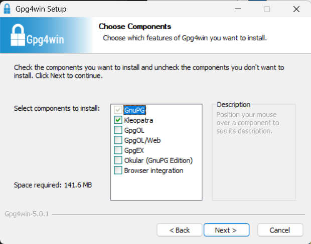
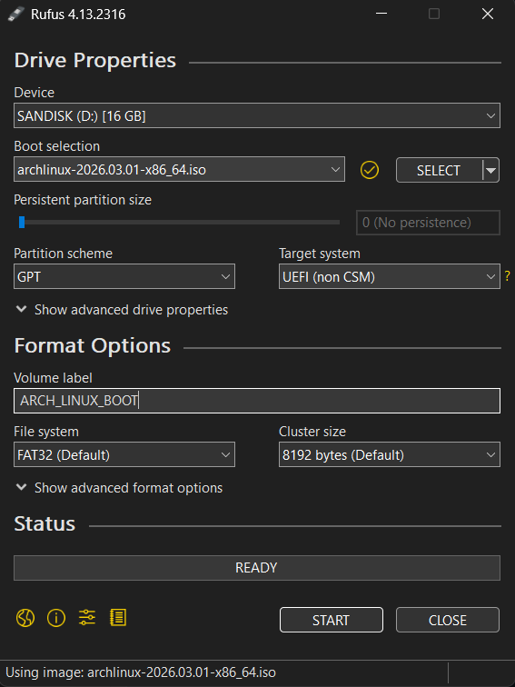

# Arch Linux Installation Process

Here are steps to install Arch Linux and understand what is happening (a very detailed noob's guide).

---

## What You Need Before Starting

1. A USB pendrive (8 GB or more).
2. Stable internet (wired or Wi-Fi).
3. A target PC/laptop for Arch installation.
4. Patience level: medium to high.

__NOTE:__
Before beginning, make sure to backup any important data on the target machine. The installation process involves partitioning and formatting disks, which will erase all existing data.

Also, ensure that there is no important data on the USB pendrive, as it will be completely wiped during the creation of the bootable installation media.

---

## 1. Download the Arch ISO (Official Source)

*What is an ISO file?*

An ISO file is a complete image of a CD/DVD/USB. It contains all the files and structure needed to create a bootable installation media.

Go to:

[https://archlinux.org/download/](https://archlinux.org/download/)

This page is a mirror selection hub. Here's what you'll find:

1. **BitTorrent option** (near top): has magnet link and `.torrent` file. You need a torrent client like `qBittorrent` or `uTorrent` to use this.

2. **HTTP Direct Downloads** (scroll down): lists 100+ mirrors by country. Pick one geographically close to you for faster download.

3. **Checksums and signatures section** (scroll down further): this is where the `.sig` file link is located.

### How to download the ISO and `.sig` file

In the **Checksums and signatures** section, you will see links like:

```
ISO
├─ PGP signature
├─ SHA256: ...
└─ BLAKE2b: ...
```

Click the **PGP signature** link to get the `.sig` file.

Alternatively, use these direct links:

- ISO: Pick any mirror from the "HTTP Direct Downloads" section (all are identical)
- `.sig` file direct link: [https://archlinux.org/iso/2026.03.01/archlinux-2026.03.01-x86_64.iso.sig](https://archlinux.org/iso/2026.03.01/archlinux-2026.03.01-x86_64.iso.sig)

Download both files to the same folder:

- `archlinux-2026.03.01-x86_64.iso` (from mirror)
- `archlinux-2026.03.01-x86_64.iso.sig` (from Checksums section)

### What is this `.sig` file and why do I care?

The `.sig` file is a digital signature for the ISO.

Think of it like this:
- ISO = package
- `.sig` = tamper-proof seal made by Arch maintainer

If signature check passes:
1. File is from the real Arch release signer.
2. File was not modified after signing.

If check fails, do not use that ISO.

---

## 2. Verify ISO Signature (Recommended)

You can skip this, but for security you really should not.

### 2.1 What is Gpg4win?

`Gpg4win` means "GnuPG for Windows".

It gives Windows users tools to:
- verify digital signatures (`.sig`)
- encrypt/decrypt files
- manage public/private keys

In this guide, you only need it to run `gpg --verify` and confirm your Arch ISO is authentic.

Install from:
- [https://gpg4win.org/](https://gpg4win.org/)

When running the .exe installer you will see these options:



For verifying the Arch ISO signature, you only need __GnuPG__ checked. Everything else can be unchecked.

However, if you want a friendly GUI alternative to command-line `gpg --verify`, keep __Kleopatra__ checked as well (it provides visual signature verification).

- ✅ GnuPG (required for the gpg command)
- ✅ Kleopatra (optional but helpful GUI tool)
- ❌ GpgOL, GpgQL.Web, GpgEX, Okular, Browser integration (not needed)

### 2.2 Verify Arch ISO on Windows

Open __PowerShell__ in folder where ISO and `.sig` are downloaded.

Copy-paste:

```powershell
gpg --auto-key-locate clear,wkd -v --locate-external-key pierre@archlinux.org
gpg --verify .\archlinux-2026.03.01-x86_64.iso.sig .\archlinux-2026.03.01-x86_64.iso
```

You should see output like:

```powershell
gpg: Good signature from "Pierre Schmitz <pierre@archlinux.org>" [unknown]
gpg: WARNING: This key is not certified with a trusted signature!
```

- Good signature = ✅ ISO is authentic and unmodified
- WARNING: not certified = ⚠️ Normal for first-time verification; you haven't manually marked the key as trusted yet (safe to ignore for basic verification)

What these commands do:
- First command fetches the public key of Arch release signer.
- Second command verifies signature against ISO file.

Expected good output includes: `Good signature`.

If you see `BAD signature` or no trusted key found, stop and re-download from official source.

---

## 3. Create Bootable Pendrive

This is where your USB becomes "bootable".

### What exactly is a bootable pendrive?

A normal USB is just storage. A bootable USB has boot files and partition layout so firmware (UEFI/BIOS) can start an OS from it.

No bootable USB = installer cannot start.

### 3.1 Easiest method for Windows users (Rufus)

Download Rufus:
- [https://rufus.ie/](https://rufus.ie/)

Steps:
1. Insert USB pendrive.
2. Open Rufus as Administrator.
3. `Device`: choose your USB.
4. `Boot selection`: choose Arch ISO file.
5. `Partition scheme`: choose `GPT` for UEFI

    __GPT vs MBR:__

    *MBR (Master Boot Record)*
    - Old partition scheme from 1983
    - Maximum disk size: 2 TB
    - Maximum partitions: 4 primary (or 3 primary + 1 extended with multiple logical)
    - Used by old BIOS firmware
    - Legacy standard, still works but outdated

    *GPT (GUID Partition Table)*
    - Modern partition scheme (part of UEFI standard)
    - Maximum disk size: 9.4 ZB (zettabytes) — practically unlimited
    - Maximum partitions: 128 by default
    - Required by UEFI firmware
    - Includes backup partition table (more reliable)
    - Better data integrity with CRC error detection

5. File system: `FAT32` (required for UEFI boot)
7. Click `START`.

Here is an example image with the correct settings:



8. Choose `Write in ISO Image Mode` when prompted.

    __ISO vs DD Write Image Mode:__

    *ISO Write Mode*
    - Rufus extracts files from the ISO and writes them using standard USB filesystem rules
    - Creates a readable USB with normal Windows folder structure
    - You can browse files in Windows Explorer after creation
    - Sometimes less compatible — some hardware may not boot from ISO mode USB
    - Slightly slower write process
    - More flexible (can edit files on USB)

    *DD Write Image Mode*
    - Rufus writes the ISO file bit-by-bit directly to the USB (raw image write)
    - Creates an exact replica of the ISO on the USB
    - Files are not in normal readable format in Windows after creation
    - Usually more compatible with all UEFI/BIOS systems
    - Faster write process
    - Better for Linux ISOs (Arch specifically)

    *NOTE: We typically start with ISO Mode as it is Rufus Default, incase Arch Installer does not start in boot mode try again with DD mode.*

7. Wait until status says complete.
8. Safely eject USB.

__WARNING__: this wipes all data on that USB.

*NOTE: Before going into boot menu please find out whether your disk is SATA or NVMe (will be used later)*

---

## 4. Boot Into Arch Installer

1. Plug bootable USB into target machine.
2. Reboot and open boot menu (`F12`, `F10`, `Esc`, `Del`, depends on manufacturer).
3. Select USB device.
4. In Arch menu, select `Arch Linux install medium`.

### What is Secure Boot and why disable it?

Secure Boot only allows trusted signed bootloaders. Official Arch ISO does not boot with default Secure Boot enabled.

So in firmware settings:
- disable Secure Boot
- boot installer
- enable/configure secure boot later if you want

> `What can go wrong here?` USB is fine, but boot menu does not show it because secure boot/boot order blocks it.

> `How to recover:` Reboot into firmware, disable Secure Boot, use one-time boot menu key, and pick USB manually.

---

## 5. First Things in Arch Live Environment

You will see terminal login shell as `root@archiso ~ #`.

### 5.1 Keyboard layout (optional)

Default keyboard layout is US. If you need a different layout, list available ones and load the correct one:

```bash
localectl list-keymaps
loadkeys uk
```

What these do:
- `localectl list-keymaps`: lists keyboard layouts.
- `loadkeys uk`: sets keyboard layout to UK for current live session.

### 5.2 Confirm boot mode (UEFI or BIOS)

```bash
cat /sys/firmware/efi/fw_platform_size
```

Output meaning:
- `64` or `32` -> booted in UEFI.
- file missing -> likely BIOS/Legacy.

### 5.3 Connect internet

Check network devices:

```bash
ip link
```
You should see `enpXsY` for wired, or `wlanX` for Wi-Fi.

If Wifi is not connected this command will show no IP address

To connect to __Wi-Fi__ with `iwctl`, follow these steps:

```bash
iwctl
device list
station wlan0 scan
station wlan0 get-networks
station wlan0 connect "YOUR_WIFI_NAME"
exit
```

Test internet:

```bash
ping -c 4 archlinux.org
```

If you see replies, you are online.

### 5.4 Check system time

```bash
timedatectl status
```
You will get output like:

```bash
Local time: Fri 2026-03-01 12:34:56 UTC
Universal time: Fri 2026-03-01 12:34:56 UTC
RTC time: Fri 2026-03-01 12:34:56
Time zone: Etc/UTC (UTC, +0000)
System clock synchronized: yes
NTP service: active
RTC in local TZ: no
```

Correct time helps prevent package signature and HTTPS errors.

To setup correct local time:

```bash
timedatectl list-timezones
```
This lists all timezones. Find yours and set it:

(Example)
```bash
timedatectl set-timezone Asia/Kolkata
```
After setting the timezone rerun:

```bash
timedatectl status
```
You should see an output like this:

```bash
Local time: Fri 2026-03-01 18:04:56 IST
Universal time: Fri 2026-03-01 12:34:56 UTC
RTC time: Fri 2026-03-01 12:34:56
Time zone: Asia/Kolkata (IST, +0530)
System clock synchronized: yes
NTP service: active
RTC in local TZ: no
```

---

## 6. Partition Disk (Simple UEFI Layout)

This section wipes target disk. READ SLOWLY.

### 6.1 Identify target disk

Run this command to list all storage devices connected to the system.
It shows disks, partitions, and their mount points

```bash
lsblk
```

(Output example)

```bash
NAME        MAJ:MIN RM  SIZE RO TYPE MOUNTPOINT
sda           8:0    0  100G  0 disk
└─sda1        8:1    0 14.9G  0 part /mnt
nvme0n1     259:0    0 1000G  0 disk
└─nvme0n1p1 259:1    0    1G  0 part
└─nvme0n1p2 259:2    0    4G  0 part
```
Meaning:

| Device      | Meaning        |
|-------------|----------------|
| `sda`       | USB installer  |
| `nvme0n1`   | Laptop SSD     |
| `nvme0n1p1` | partition      |
| `nvme0n1p2` | partition      |

Common disk names:
- SATA SSD/HDD -> `/dev/sda`
- NVMe SSD -> `/dev/nvme0n1`

We partition:

`nvme0n1` -> Laptop SSD

DO NOT accidentally pick your USB installer disk.

### 6.2 Create partitions with `cfdisk`

cfdisk is a text-based partitioning tool. You can also use `fdisk` or `parted`, but `cfdisk` has a more user-friendly interface.

Run this command to open the partitioning tool for the target disk:

```bash
cfdisk /dev/nvme0n1
```

The first screen asks:
```bash
Select label type:
  [ ] dos
  [ ] gpt
  ...
```
choose `gpt` (GUID Partition Table) for modern UEFI systems.

### *6.2.1 Understanding `cfdisk` Interface*

You will see something like:
```bash
Disk: /dev/nvme0n1
Size: 476 GiB

Device        Size     Type
--------------------------------

Free space    476GiB
```
Bottom menu shows actions:
```bash
[ New ] [ Delete ] [ Resize ] [Type] [write] [ Quit ] [ Help ]
```
Navigation:
| Key         | Function                |
|-------------|-------------------------|
| `Arrow Keys`| move selection          |
| `Enter`     | select option           |
| `Tab`       | move between menu items |

### *6.2.2 Deleting existing partitions*

(Example)
```bash
nvme0n1p1
nvme0n1p2
```
Steps:

1. Highlight partition
2. Select:
```bash
[Delete]
```
3. Press Enter

Repeat until you see:
```bash
Free Space
```
Purpose:
    Removes previous OS partitions (Windows/Linux).

### *6.2.3 Create EFI partition*

Select:
```bash
Free space
```
Enter:
```bash
[New]
```
Enter size:
```bash
512M
```
Press __Enter__.

Now Change Type to `EFI System`:

Select:
```bash
[Type]
```
Choose:
```bash
EFI System
```
Press __Enter__.

Purpose:
- Stores bootloader files.
- Required for UEFI boot.

### *6.2.4 Create Swap partition*

Select:
```bash
Free space
```
Enter:
```bash
[New]
```
Enter size:
```bash
8G
```
Now Change Type to `Linux swap`:

Select:
```bash
[Type]
```
Choose:
```bash
Linux swap
```
Press __Enter__.

Purpose:
- Used when RAM is full.
- 8GB is a common size for swap, but you can adjust based on your needs (e.g., 4GB for light use, 16GB+ for heavy workloads).

### *6.2.5 Create root partition*

Rest of the free space is used.

Select:
```bash
Free space
```
Enter:
```bash
[New]
```
Press Enter to use __all remaining space__.

leave `type` as default (`Linux filesystem`).

Purpose
- Main partition where Arch Linux Installs.

Expected partition names:
- `/dev/nvme0n1p1` EFI
- `/dev/nvme0n1p2` SWAP
- `/dev/nvme0n1p3` ROOT

### *6.2.6 Write changes to disk*

Until now __nothing has actually changed on disk__.

Select:
```bash
[Write]
```
Press __Enter__ to confirm.

Purpose
- Applies partition table changes to disk

### *6.2.7 Exit `cfdisk`*

Select:
```bash
[Quit]
```
Press __Enter__.

### 6.3 Verify partitions

Run:
```bash
lsblk
```

You should see:
```bash
nvme0n1
├─nvme0n1p1 512M
├─nvme0n1p2 8G
└─nvme0n1p3 467G
```

Meaning:
| Partition   | Purpose          |
|-------------|------------------|
| `nvme0n1p1` | EFI              |
| `nvme0n1p2` | Swap             |
| `nvme0n1p3` | Root filesystem  |

### 6.3 Format partitions

```bash
mkfs.fat -F 32 /dev/nvme0n1p1
mkswap /dev/nvme0n1p2
swapon /dev/nvme0n1p2
mkfs.ext4 /dev/nvme0n1p3
```

What each command does:
- `mkfs.fat -F 32`: makes FAT32 filesystem for EFI partition.
- `mkswap`: prepares swap partition.
- `swapon`: Activates the swap partiton immediately.
Without this command the swap space is not usable.
- `mkfs.ext4`: makes ext4 filesystem for root partition.

### 6.4 Mount partitions

```bash
mount /dev/nvme0n1p3 /mnt
mkdir /mnt/boot
mount /dev/nvme0n1p1 /mnt/boot
```

Meaning:
- Root partition is mounted to `/mnt` (install target path).
- Creates a directory where the EFI partition will mount.
- EFI partition mounted at `/mnt/boot`.

Final mount structure:
```bash
/mnt      -> root filesystem
/mnt/boot -> EFI partition
```

> `What can go wrong here?` Formatting the wrong disk (most serious mistake), or creating wrong partition layout.

> `How to recover:` Stop and check `lsblk` right away. If wrong disk was selected, stop install and restore from backup; if only mount paths are wrong, unmount and remount correctly.

---

## 7. Install Base Arch System

```bash
pacstrap /mnt base linux linux-firmware nano networkmanager grub efibootmgr
```

Purpose:
- Installs the base operating system.

Packages Installed:
| Package        | Purpose                |
| -------------- | ---------------------- |
| base           | minimal Arch system    |
| linux          | kernel                 |
| linux-firmware | hardware firmware      |
| nano           | text editor            |
| networkmanager | network management     |
| grub           | bootloader             |
| efibootmgr     | EFI boot configuration |

__Warning seen__

During pacstrap you saw:
```bash
ERROR: file not found: /etc/vconsole.conf
```

Explanation:
- This is not a fatal error
- It occurs because console settings were not yet configured.
- Installation still succeeded.

### 7.1.1 Generating filesystem table

Command:
```bash
genfstab -U /mnt >> /mnt/etc/fstab
```
Purpose:
- Generates the fstab file.
fstab tells Linux:
- where partitions are
- where to mount them at boot.

Check file:
```bash
cat /mnt/etc/fstab
```
You should see entries for your root and EFI partitions.

> `What can go wrong here?` `pacstrap` fails due to no internet/mirror issues, or `genfstab` writes empty/incorrect entries.

> `How to recover:` Verify internet with `ping archlinux.org`, re-run `pacstrap`, then run `genfstab` again and inspect `/mnt/etc/fstab`.

---

## 8. Configure Installed System

Command:
```bash
arch-chroot /mnt
```

Purpose:
- Changes root directory to /mnt.
- Allows configuring the newly installed system as if we booted into it.

Prompt becomes:
```bash
[root@archlinux /]#
```

### 8.1 Set timezone and hardware clock

```bash
ln -sf /usr/share/zoneinfo/Asia/Kolkata /etc/localtime
hwclock --systohc
```

Purpose:
| Command | Function             |
| ------- | -------------------- |
| ln      | sets timezone        |
| hwclock | syncs hardware clock |

Replace `Asia/Kolkata` with your region if needed.

### 8.2 Configure locale (language/encoding)

```bash
nano /etc/locale.gen
```

Uncomment:

```text
en_US.UTF-8 UTF-8
```

Then run:

```bash
locale-gen
echo "LANG=en_US.UTF-8" > /etc/locale.con
```

Purpose:
- defines language and character encoding.

### 8.3 Set hostname (your PC name)

```bash
nano /etc/hostname
```

(Example hostname)
```bash
arch
```

OR directly run

```bash
echo "arch" > /etc/hostname
```

Optional hosts file:

```bash
cat > /etc/hosts << 'EOF'
127.0.0.1   localhost
::1         localhost
127.0.1.1   myarchpc.localdomain myarchpc
EOF
```
Purpose:
- name of the computer on network.

### 8.4 Set root password

```bash
passwd
```

Type pasword for the root account.

### 8.6 Enable network manager at boot

```bash
systemctl enable NetworkManager
```

> `What can go wrong here?` Locale not uncommented properly, wrong timezone, or user created without sudo access.

> `How to recover:` Re-open edited files (`/etc/locale.gen`, `visudo`), fix line, and rerun `locale-gen` or `visudo` save.

---

## 9. Install Bootloader (GRUB, UEFI)

Install packages:

```bash
pacman -S grub efibootmgr
```

Install and generate config:

```bash
grub-install --target=x86_64-efi --efi-directory=/boot --bootloader-id=GRUB
grub-mkconfig -o /boot/grub/grub.cfg
```

What this does:
- Installs GRUB bootloader in EFI partition.
- Creates boot menu config so system can boot Arch kernel.


> `What can go wrong here?` GRUB installed to wrong path, or EFI partition was not mounted at `/boot`.

> `How to recover:` Run `lsblk` to confirm `/boot` mount, remount EFI to `/boot`, and re-run `grub-install` plus `grub-mkconfig`.

---

## 10. Finish and Reboot

```bash
exit
umount -R /mnt
reboot
```

Purpose:
| Command | Purpose           |
| ------- | ----------------- |
| exit    | leave chroot      |
| umount  | detach partitions |
| reboot  | restart system    |

Remove USB when reboot starts.

> `What can go wrong here?` You forget to remove USB and boot back into installer, or get a black screen due to boot order.

> `How to recover in 2 minutes.` Remove USB, reboot, open boot menu, and choose your internal disk/GRUB entry.

---

## 11. Some Command and its Meanings

- `ls`: similar to Windows `dir`; lists files/folders.
- `cd`: change directory.
- `pwd`: print working directory (current location).
- `cat`: print file text.
- `nano`: simple terminal text editor.
- `sudo`: run command with admin rights.
- `ip link`: list network interfaces.
- `ping`: test network reachability.
- `lsblk`: list disks and partitions.
- `fdisk\cfdisk`: create/edit partitions.
- `mkfs`: create filesystem.
- `mount`: attach partition to filesystem tree.
- `umount`: detach partition.
- `swapon`: enable swap partition.
- `pacstrap`: install base system to mounted target.
- `genfstab`: write persistent mount rules.
- `arch-chroot`: enter installed system environment.
- `pacman -S`: install package.
- `systemctl enable`: auto-start service at boot.
- `passwd`: set password.

Quick examples:

```bash
ls
ls -la
sudo pacman -Syu
```

---

## 12. Troubleshooting

### USB not booting

1. Recreate USB with Rufus and use `DD mode`.
2. Use another USB port (old hardware often likes USB 2.0 port).
3. Disable Secure Boot.
4. Confirm firmware boot mode is UEFI.

### No internet in installer

```bash
ip link
ping -c 4 1.1.1.1
ping -c 4 archlinux.org
```

If no Wi-Fi, reconnect with `iwctl` commands from __section 5.3__.

### Bootloader problem after install

Boot installer again, remount partitions, `arch-chroot`, rerun GRUB commands.

---

## 13. Sources

- [https://wiki.archlinux.org/title/Installation_guide](https://wiki.archlinux.org/title/Installation_guide)
- [https://wiki.archlinux.org/title/USB_flash_installation_medium](https://wiki.archlinux.org/title/USB_flash_installation_medium)
- [https://archlinux.org/download/](https://archlinux.org/download/)
