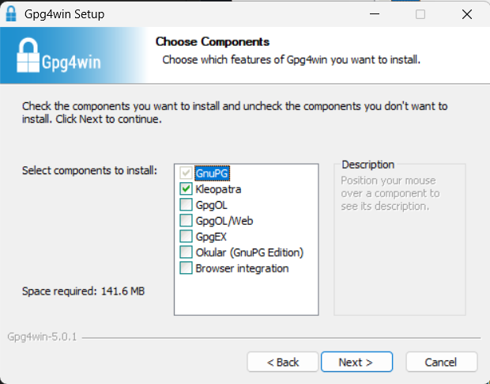
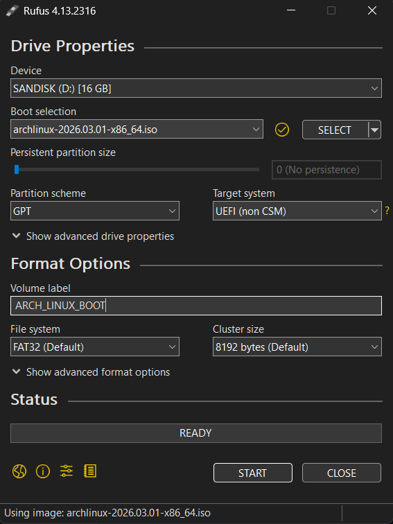

# Arch Linux Installation Process

Here are steps to install Arch Linux and understand what is happening (a very detailed noob's guide).

---

## What You Need Before Starting

1. A USB pendrive (8 GB or more).
2. Stable internet (wired or Wi-Fi).
3. A target PC/laptop for Arch installation.
4. Patience level: medium to high.

__NOTE:__
Before beginning, make sure to backup any important data on the target machine. The installation process involves partitioning and formatting disks, which will erase all existing data.

Also, ensure that there is no important data on the USB pendrive, as it will be completely wiped during the creation of the bootable installation media.

---

## 1. Download the Arch ISO (Official Source)

*What is an ISO file?*

An ISO file is a complete image of a CD/DVD/USB. It contains all the files and structure needed to create a bootable installation media.

Go to:

[https://archlinux.org/download/](https://archlinux.org/download/)

This page is a mirror selection hub. Here's what you'll find:

1. **BitTorrent option** (near top): has magnet link and `.torrent` file. You need a torrent client like `qBittorrent` or `uTorrent` to use this.

2. **HTTP Direct Downloads** (scroll down): lists 100+ mirrors by country. Pick one geographically close to you for faster download.

3. **Checksums and signatures section** (scroll down further): this is where the `.sig` file link is located.

### How to download the ISO and `.sig` file

In the **Checksums and signatures** section, you will see links like:

```
ISO
├─ PGP signature
├─ SHA256: ...
└─ BLAKE2b: ...
```

Click the **PGP signature** link to get the `.sig` file.

Alternatively, use these direct links:

- ISO: Pick any mirror from the "HTTP Direct Downloads" section (all are identical)
- `.sig` file direct link: [https://archlinux.org/iso/2026.03.01/archlinux-2026.03.01-x86_64.iso.sig](https://archlinux.org/iso/2026.03.01/archlinux-2026.03.01-x86_64.iso.sig)

Download both files to the same folder:

- `archlinux-2026.03.01-x86_64.iso` (from mirror)
- `archlinux-2026.03.01-x86_64.iso.sig` (from Checksums section)

### What is this `.sig` file and why do I care?

The `.sig` file is a digital signature for the ISO.

Think of it like this:
- ISO = package
- `.sig` = tamper-proof seal made by Arch maintainer

If signature check passes:
1. File is from the real Arch release signer.
2. File was not modified after signing.

If check fails, do not use that ISO.

---

## 2. Verify ISO Signature (Recommended)

You can skip this, but for security you really should not.

### 2.1 What is Gpg4win?

`Gpg4win` means "GnuPG for Windows".

It gives Windows users tools to:
- verify digital signatures (`.sig`)
- encrypt/decrypt files
- manage public/private keys

In this guide, you only need it to run `gpg --verify` and confirm your Arch ISO is authentic.

Install from:
- [https://gpg4win.org/](https://gpg4win.org/)

When running the .exe installer you will see these options:



For verifying the Arch ISO signature, you only need __GnuPG__ checked. Everything else can be unchecked.

However, if you want a friendly GUI alternative to command-line `gpg --verify`, keep __Kleopatra__ checked as well (it provides visual signature verification).

- ✅ GnuPG (required for the gpg command)
- ✅ Kleopatra (optional but helpful GUI tool)
- ❌ GpgOL, GpgQL.Web, GpgEX, Okular, Browser integration (not needed)

### 2.2 Verify Arch ISO on Windows

Open __PowerShell__ in folder where ISO and `.sig` are downloaded.

Copy-paste:

```powershell
gpg --auto-key-locate clear,wkd -v --locate-external-key pierre@archlinux.org
gpg --verify .\archlinux-2026.03.01-x86_64.iso.sig .\archlinux-2026.03.01-x86_64.iso
```

You should see output like:

```powershell
gpg: Good signature from "Pierre Schmitz <pierre@archlinux.org>" [unknown]
gpg: WARNING: This key is not certified with a trusted signature!
```

- Good signature = ✅ ISO is authentic and unmodified
- WARNING: not certified = ⚠️ Normal for first-time verification; you haven't manually marked the key as trusted yet (safe to ignore for basic verification)

What these commands do:
- First command fetches the public key of Arch release signer.
- Second command verifies signature against ISO file.

Expected good output includes: `Good signature`.

If you see `BAD signature` or no trusted key found, stop and re-download from official source.

---

## 3. Create Bootable Pendrive

This is where your USB becomes "bootable".

### What exactly is a bootable pendrive?

A normal USB is just storage. A bootable USB has boot files and partition layout so firmware (UEFI/BIOS) can start an OS from it.

No bootable USB = installer cannot start.

### 3.1 Easiest method for Windows users (Rufus)

Download Rufus:
- [https://rufus.ie/](https://rufus.ie/)

Steps:
1. Insert USB pendrive.
2. Open Rufus as Administrator.
3. `Device`: choose your USB.
4. `Boot selection`: choose Arch ISO file.
5. `Partition scheme`: choose `GPT` for UEFI

    __GPT vs MBR:__

    *MBR (Master Boot Record)*
    - Old partition scheme from 1983
    - Maximum disk size: 2 TB
    - Maximum partitions: 4 primary (or 3 primary + 1 extended with multiple logical)
    - Used by old BIOS firmware
    - Legacy standard, still works but outdated

    *GPT (GUID Partition Table)*
    - Modern partition scheme (part of UEFI standard)
    - Maximum disk size: 9.4 ZB (zettabytes) — practically unlimited
    - Maximum partitions: 128 by default
    - Required by UEFI firmware
    - Includes backup partition table (more reliable)
    - Better data integrity with CRC error detection

6. `File system`: `FAT32` (required for UEFI boot)
7. Click `START`.

Here is an example image with the correct settings:



8. Choose `Write in ISO Image Mode` when prompted.

    __ISO vs DD Write Image Mode:__

    *ISO Write Mode*
    - Rufus extracts files from the ISO and writes them using standard USB filesystem rules
    - Creates a readable USB with normal Windows folder structure
    - You can browse files in Windows Explorer after creation
    - Sometimes less compatible — some hardware may not boot from ISO mode USB
    - Slightly slower write process
    - More flexible (can edit files on USB)

    *DD Write Image Mode*
    - Rufus writes the ISO file bit-by-bit directly to the USB (raw image write)
    - Creates an exact replica of the ISO on the USB
    - Files are not in normal readable format in Windows after creation
    - Usually more compatible with all UEFI/BIOS systems
    - Faster write process
    - Better for Linux ISOs (Arch specifically)

    *NOTE: We typically start with ISO Mode as it is Rufus Default, incase Arch Installer does not start in boot mode try again with DD mode.*

9. Wait until status says complete.
10. Safely eject USB.

__WARNING__: this wipes all data on that USB.

*NOTE: Before going into boot menu please find out whether your disk is SATA or NVMe (will be used later)*

---

## 4. Boot Into Arch Installer

1. Plug bootable USB into target machine.
2. Reboot and open boot menu (`F12`, `F10`, `Esc`, `Del`, depends on manufacturer).
3. Select USB device.
4. In Arch menu, select `Arch Linux install medium`.

### What is Secure Boot and why disable it?

Secure Boot only allows trusted signed bootloaders. Official Arch ISO does not boot with default Secure Boot enabled.

So in firmware settings:
- disable Secure Boot
- boot installer
- enable/configure secure boot later if you want

> `What can go wrong here?` USB is fine, but boot menu does not show it because secure boot/boot order blocks it.

> `How to recover:` Reboot into firmware, disable Secure Boot, use one-time boot menu key, and pick USB manually.

---

## 5. First Things in Arch Live Environment

You will see terminal login shell as `root@archiso ~ #`.

### 5.1 Keyboard layout (optional)

Default keyboard layout is US. If you need a different layout, list available ones and load the correct one:

```bash
localectl list-keymaps
loadkeys uk
```

What these do:
- `localectl list-keymaps`: lists keyboard layouts.
- `loadkeys uk`: sets keyboard layout to UK for current live session.

### 5.2 Confirm boot mode (UEFI or BIOS)

```bash
cat /sys/firmware/efi/fw_platform_size
```

Output meaning:
- `64` or `32` -> booted in UEFI.
- file missing -> likely BIOS/Legacy.

What this does:
- `cat` is a command to read file contents.
- `/sys/firmware/efi/fw_platform_size` is a special file that exists only if the system booted in UEFI mode. It contains the bitness of the firmware (32 or 64).

*What is different between UEFI and BIOS?*
1. UEFI:
- Modern firmware standard that uses GPT partition table.
- Uses EFI System Partition (ESP) to store bootloaders.
- Supports secure boot, faster boot times, and larger disks (> 2TB).
- Standard on modern PCs and laptops.

2. BIOS (Legacy):
- Older firmware standard that uses MBR partition table.
- Bootloader is stored in the Master Boot Record (MBR) of the disk.
- Limited to 4 primary partitions and disks up to 2TB.

If BIOS/Legacy mode  was used you would have to use this command to check the boot mode:

```bash
ls /sys/firmware/efi
```

Where for BIOS mode instead of 32 or 64 you will get `No such file or directory` error.

### 5.3 Connect internet

Check network devices:

```bash
ip link
```
You will see something like:

```bash
1: lo: <LOOPBACK,UP,LOWER_UP> mtu 65536 qdisc noqueue state UNKNOWN mode DEFAULT group default qlen 1000
    link/loopback 00:00:00:00:00:00 brd 00:00:00:00:00:00

2: eno1: <BROADCAST,MULTICAST,UP,LOWER_UP> mtu 1500 qdisc fq_codel state DOWN mode DEFAULT group default qlen 1000
    link/ether 12:34:56:78:9a:bc brd ff:ff:ff:ff:ff:ff

3: wlan0: <BROADCAST,MULTICAST> mtu 1500 qdisc noop state DOWN mode DEFAULT group default qlen 1000
    link/ether 12:34:56:78:9a:bc brd ff:ff:ff:ff:ff:ff
```

If Wifi is not connected, wlan0 will show as `DOWN` and no IP address. You can connect to Wi-Fi using `iwctl` (iNet wireless daemon).

To connect to __Wi-Fi__ with `iwctl`, follow these steps:

```bash
iwctl
device list
station wlan0 scan
station wlan0 get-networks
station wlan0 connect "YOUR_WIFI_NAME"
exit
```

Test internet:

```bash
ping -c 4 archlinux.org
```

If you see replies, you are online.

*What are the other options that I can use to connect to Wi-Fi?*

1. `iwd` (iNet wireless daemon):
- Default in Arch installer.
- Command-line only.
- lightweight and modern.

2. `NetworkManager`:
- More user-friendly with `nmtui` text UI.
- More desktop users use this, but it is not included in the base installer environment by default.
- Heavier than iwd, but easier for complex Wi-Fi setups.

3. `wpa_supplicant`:
- Older, more manual tool.
- Requires editing config files.
- More flexible for advanced users, but not beginner-friendly.

*For Ethernet*:
- If you have a wired connection, it should work automatically without any setup. Just check with `ip link` and `ping` to confirm.

### 5.4 Check system time

```bash
timedatectl status
```
You will get output like:

```bash
Local time: Fri 2026-03-01 12:34:56 UTC
Universal time: Fri 2026-03-01 12:34:56 UTC
RTC time: Fri 2026-03-01 12:34:56
Time zone: Etc/UTC (UTC, +0000)
System clock synchronized: yes
NTP service: active
RTC in local TZ: no
```

Correct time helps prevent package signature and HTTPS errors.

To setup correct local time:

```bash
timedatectl list-timezones
```
This lists all timezones. Find yours and set it:

(Example)
```bash
timedatectl set-timezone Asia/Kolkata
```
After setting the timezone rerun:

```bash
timedatectl status
```
You should see an output like this:

```bash
Local time: Fri 2026-03-01 18:04:56 IST
Universal time: Fri 2026-03-01 12:34:56 UTC
RTC time: Fri 2026-03-01 12:34:56
Time zone: Asia/Kolkata (IST, +0530)
System clock synchronized: yes
NTP service: active
RTC in local TZ: no
```

---

## 6. Partition Disk (Simple UEFI Layout)

This section wipes target disk. READ SLOWLY.

### 6.1 Identify target disk

Run this command to list all storage devices connected to the system.
It shows disks, partitions, and their mount points

```bash
lsblk
```

(Output example)

```bash
NAME        MAJ:MIN RM  SIZE RO TYPE MOUNTPOINT
sda           8:0    0  14.9G 0 disk
└─sda1        8:1    0  14.9G 0 part /mnt
nvme0n1     259:0    0   476G 0 disk
├─nvme0n1p1 259:1    0   512M 0 part
└─nvme0n1p2 259:2    0 475.5G 0 part
```
Meaning:

| Device      | Meaning        |
|-------------|----------------|
| `sda`       | USB installer  |
| `nvme0n1`   | Laptop SSD     |
| `nvme0n1p1` | partition      |
| `nvme0n1p2` | partition      |

Common disk names:
- SATA SSD/HDD -> `/dev/sda`
- NVMe SSD -> `/dev/nvme0n1`

We partition:

`nvme0n1` -> Laptop SSD

DO NOT accidentally pick your USB installer disk.

### 6.2 Partitioning Options and flavours

*Partitioning tools:*
- `fdisk`: older, more manual, command-line only.
- `parted`: more powerful, supports scripting, but has a steeper learning curve.
- `gdisk`: GPT-focused, similar to fdisk but for GPT disks.
- `cfdisk`: user-friendly, curses-based interface, good for beginners.

### __`cfdisk`__:

Run this command to open the partitioning tool for the target disk:

```bash
cfdisk /dev/nvme0n1
```

The first screen asks:
```bash
Select label type:
  [ ] dos
  [ ] gpt
  ...
```
*Difference between dos and gpt:*
1. `dos` (MBR):
- Old partitioning scheme.
- Max disk size: 2TB.
- Max partitions: 4 primary (or 3 primary + 1 extended with multiple logical).
- Used by legacy BIOS systems.

2. `gpt` (GUID Partition Table):
- Modern partitioning scheme.
- Max disk size: 9.4 ZB (practically unlimited).
- Max partitions: 128 by default.
- Required for UEFI systems.
- More reliable with backup partition table and CRC checks.

#### *6.2.1 Understanding `cfdisk` Interface*

You will see something like:
```bash
Disk: /dev/nvme0n1
Size: 476 GiB

Device        Size     Type
--------------------------------

Free space    476GiB
```
Bottom menu shows actions:
```bash
[ Delete ] [ Resize ] [ Quit ] [Type] [Help] [Write] [ Dump ]
```

*What each menu option does:*
| Option   | Function                                                |
|----------|---------------------------------------------------------|
| Delete   | Deletes Current partition                               |
| Resize   | Reduce or enlarge the current partition                 |
| Quit     | Quit program without saving changes                     |
| Type     | Change partition type (e.g., EFI, Linux swap)           |
| Help     | Print help screen                                       |
| Write    | Write partition table to disk (this might destroy data) |
| Dump     | Dump partition table to sfdisk compatible script file   |

Navigation:
| Key         | Function                |
|-------------|-------------------------|
| `Arrow Keys`| move selection          |
| `Enter`     | select option           |
| `Tab`       | move between menu items |

#### *6.2.2 Deleting existing partitions*

(Example)
```bash
nvme0n1p1
nvme0n1p2
```
Steps:

1. Highlight partition
2. Select:
```bash
[Delete]
```
3. Press Enter

Repeat until you see:
```bash
Free Space
```
Purpose:
    Removes previous OS partitions (Windows/Linux).

#### *6.2.3 Different Partition Layouts:*
1. Minimal:
- __EFI__ (512MB)
- __ROOT__ (rest of disk)
- No swap (uses zram or RAM only), swap as a file later if needed.

2. Standard:
- __EFI__ (512MB)
- __SWAP__ (8GB)
- __ROOT__ (rest of disk)
- __USER__ (optional separate partition for /home)
- Separates personal files from system files, but more complex.
- Advantage: OS reinstall does not wipe user files.

3. LVM Layout:
- __ROOT__
- __HOME__
- __SWAP__
- Uses Logical Volume Manager for flexible partition resizing and snapshots.
- More complex setup, but allows dynamic resizing and better management.
- *NOTE:* Using `btrfs` with subvolumes can provide similar benefits without the complexity of LVM.

4. Btrfs Subvolumes:
- EFI
- BTRFS
- Inside BTRFS:
    - @
    - @home
    - @snapshots
    - @var
- This is modern layout using Btrfs filesystem with subvolumes for better snapshot and backup management.

#### *6.2.4 Different filesystem choices:*
1. `ext4`: most common, stable, and widely supported Linux filesystem. No snapshot support, but very reliable for general use.
2. `btrfs`: modern filesystem with built-in snapshot and compression features. More complex, but great for advanced users who want easy backups and rollbacks.
3. `xfs`: high-performance filesystem optimized for large files and parallel I/O. Not as widely supported as ext4, but good for specific workloads like databases or media editing.
4. `f2fs`: filesystem designed for flash storage (like SSDs). Can improve performance on certain devices, but less mature than ext4.

#### *6.2.5 Different swap options:*
1. `No swap`: relies on RAM only, or uses __zram__ (compressed RAM swap). Good for systems with lots of RAM (16GB+), but can lead to out-of-memory issues if RAM is exhausted.
2. `Swap partition`: traditional method, creates a dedicated partition for swap space. Common sizes are 4GB, 8GB, or 16GB depending on your needs.
3. `Swap file`: creates a swap file on the root partition instead of a separate partition. More flexible and easier to resize, but slightly less efficient than a dedicated swap partition.

#### *6.2.6 Encryption options:*
1. `No encryption`: simplest setup, but data on disk is not protected if the device is lost or stolen.
2. `LUKS encryption`: encrypts the entire root partition (or specific partitions) using LUKS. Provides strong security, but adds complexity to the setup and requires entering a passphrase at boot.

> I personally went with LUKS Encryption + Btrfs layout + ZRAM. Steps are shown below for this flavour of disk partitioning.

> __Final Layout:__
>
>UEFI firmware
>
>↓
>
>GPT partition table
>
>↓
>
>EFI partition (FAT32)
>
>↓
>
>LUKS encryption
>
>↓
>
>Btrfs filesystem
>
>    ├ @ (root)
>
>    ├ @home
>
>    ├ @snapshots
>
>    └ @var
>
>↓
>
>Swap via ZRAM

### 6.3 Create EFI partition

Select:
```bash
Free space
```
Enter:
```bash
[New]
```
Enter size:
```bash
512M
```
Press __Enter__.

Now Change Type to `EFI System`:

Select:
```bash
[Type]
```
Choose:
```bash
EFI System
```
Press __Enter__.

__Purpose:__
- Stores bootloader files, boot entries, kernel loaders, and other firmware-related files.
- Required for UEFI boot.

### *6.2.4 Create root partition*

Rest of the free space is used.

Select:
```bash
Free space
```
Enter:
```bash
[New]
```
Press Enter to use __all remaining space__.

leave `type` as default (`Linux filesystem`).

Purpose
- Main partition where Arch Linux Installs.

Expected partition names:
- `/dev/nvme0n1p1` EFI
- `/dev/nvme0n1p2` ROOT

### *6.2.5 Write changes to disk*

Until now __nothing has actually changed on disk__.

Select:
```bash
[Write]
```

Type:
```bash
yes
```

Press __Enter__ to confirm.

Purpose
- Applies partition table changes to disk

### *6.2.6 Exit `cfdisk`*

Select:
```bash
[Quit]
```
Press __Enter__.

### 6.7 Verify partitions

Run:
```bash
lsblk
```

You should see:
```bash
nvme0n1
├─nvme0n1p1 512M
└─nvme0n1p2 475.5G
```

Meaning:
| Partition   | Purpose          |
|-------------|------------------|
| `nvme0n1p1` | EFI              |
| `nvme0n1p2` | Root filesystem  |

### 6.4 Format partitions

```bash
mkfs.fat -F 32 /dev/nvme0n1p1
mkfs.xfs -f /dev/nvme0n1p2
```

- `mkfs.fat -F 32`: makes FAT32 filesystem for EFI partition.
- `mkfs.xfs -f`: makes high-performance XFS filesystem for the root partition (-f forces format if previously used).

### 6.5 Mount partitions

Mount the root partition first, then create the boot directory and mount the EFI partition.

```bash
mount /dev/nvme0n1p2 /mnt
mkdir /mnt/boot
mount /dev/nvme0n1p1 /mnt/boot
```

Meaning:
- Root partition mounted at `/mnt`.
- EFI partition mounted at `/mnt/boot`.

> `What can go wrong here?` Formatting the wrong disk (most serious mistake), or creating wrong partition layout.

and:
```bash
nvme0n1p1 mounted at /mnt/boot
```

---

## 7. Install Base Arch System

### 7.0 Update mirror list (recommended)

Before installing packages, it is recommended to ensure you have fast mirrors. The live environment comes with a default mirror list, but you can optimize it using `reflector`:

```bash
pacstrap /mnt base linux linux-firmware neovim networkmanager grub efibootmgr zram-generator xfsprogs
```

Replace `"India"` with your country. This selects the fastest HTTPS mirrors updated in the last 12 hours.

*What is a mirror?*
A mirror is a server that hosts copies of all Arch Linux packages. Faster mirrors = faster downloads during installation. The mirror list at `/etc/pacman.d/mirrorlist` determines which servers `pacman` (the package manager) uses.

> __NOTE:__ This step is optional. The default mirrors will work, but may be slow depending on your location.

### 7.1 Install packages with pacstrap

```bash
pacstrap -K /mnt base linux linux-firmware nano networkmanager btrfs-progs cryptsetup sudo zram-generator
```

*What is the `-K` flag?*

The `-K` flag initializes an empty pacman keyring in the new system. This is the recommended approach per the official Arch Wiki — it ensures the installed system starts with a fresh, properly initialized keyring for verifying package signatures.

Purpose:
- Installs the Arch packages into the mounted filesystem (/mnt).

So packages will be installed into:
```bash
/mnt -> your new root filesystem
```

Packages Installed:
| Package        | Purpose                |
| -------------- | ---------------------- |
| base           | minimal Arch system    |
| linux          | kernel                 |
| linux-firmware | hardware firmware      |
| neovim         | text editor            |
| networkmanager | network management     |
| grub           | bootloader             |
| efibootmgr     | EFI boot configuration |
| zram-generator | Manages ZRAM swap      |
| xfsprogs       | XFS filesystem utilities |

__Warning seen__

During pacstrap you may see:
```bash
ERROR: file not found: /etc/vconsole.conf
```

Explanation:
- This is not a fatal error.
- It occurs because console settings were not yet configured.
- Installation still succeeded.
- We will create this file later in the configuration step.

### 7.2 Generating filesystem table

Command:
```bash
genfstab -U /mnt >> /mnt/etc/fstab
```
Purpose:
- Generates the fstab file.
fstab tells Linux:
- where partitions are
- where to mount them at boot.
- `-U` uses UUIDs for identifying partitions (more reliable than device names).

Check file:
```bash
cat /mnt/etc/fstab
```
You should see entries for your root and EFI partitions.
(Example)
```bash
UUID=xxxx / btrfs subvol=@
UUID=xxxx /home btrfs subvol=@home
UUID=xxxx /.snapshots btrfs subvol=@snapshots
UUID=xxxx /var btrfs subvol=@var
UUID=xxxx /boot vfat
```

> `What can go wrong here?` `pacstrap` fails due to no internet/mirror issues, or `genfstab` writes empty/incorrect entries.

> `How to recover:` Verify internet with `ping archlinux.org`, re-run `pacstrap`, then run `genfstab` again and inspect `/mnt/etc/fstab`.

---

## 8. Configure Installed System

Command:
```bash
arch-chroot /mnt
```

Purpose:
- Changes root directory to /mnt.
- Allows configuring the newly installed system as if we booted into it.

Prompt becomes:
```bash
[root@archiso /]#
```

### 8.1 Set timezone and hardware clock

```bash
ln -sf /usr/share/zoneinfo/Asia/Kolkata /etc/localtime
hwclock --systohc
```

Purpose:
| Command | Function             |
| ------- | -------------------- |
| ln      | sets timezone        |
| hwclock | syncs hardware clock |

Replace `Asia/Kolkata` with your region if needed.

### 8.2 Configure locale (language/encoding)

```bash
nvim /etc/locale.gen
```

Uncomment:

```text
en_US.UTF-8 UTF-8
```

Then run:

```bash
locale-gen
echo "LANG=en_US.UTF-8" > /etc/locale.conf
```

Purpose:
- defines language and character encoding.

### 8.2.1 Configure console keymap (fixes vconsole.conf warning)

If you changed the keyboard layout in section 5.1, make it persistent:

```bash
echo "KEYMAP=us" > /etc/vconsole.conf
```

Replace `us` with whatever keymap you used earlier (e.g., `uk`, `de-latin1`).

If you did **not** change the keyboard layout, you can still create the file with the default US keymap to prevent the warning we saw during pacstrap:

```bash
echo "KEYMAP=us" > /etc/vconsole.conf
```

*What is vconsole.conf?*
This file tells systemd what keyboard layout and console font to use for the Linux virtual console (the text-only terminal you see before a desktop environment loads). Without this file, the system will use defaults but may show warnings during boot.

### 8.3 Set hostname (your PC name)

```bash
nvim /etc/hostname
```

(Example hostname)
```bash
arch
```

OR directly run

```bash
echo "arch" > /etc/hostname
```

>__NOTE:__
>
>"arch" is just a name given, any name of your choice to name the PC can be given.

__Configure Hosts File:__

Run:
```bash
nano /etc/hosts
```

Add this:
```bash
127.0.0.1   localhost
::1         localhost
127.0.1.1   arch.localdomain arch
```

Save and exit.

This allows your machine to resolve its own hostname (`arch`) to the loopback IP address.


### 8.4 Set root password

```bash
passwd
```

Type password for the root account.

### 8.5 Create a regular user account

It is dangerous to use the `root` account for daily tasks. Create a normal user and give them admin (`sudo`) rights. Replace `username` with your desired name.

```bash
useradd -m -G wheel username
passwd username
```

Install `sudo`:
```bash
pacman -S sudo
```

Allow users in the `wheel` group to use `sudo`:
```bash
EDITOR=nvim visudo
```
Find this line and remove the `#` at the very beginning to uncomment it:
```text
# %wheel ALL=(ALL:ALL) ALL
```
Save and exit (`:wq` then `Enter`).

### 8.5 Create a regular user account

Running everything as `root` (admin) is dangerous — one wrong command can break your entire system. Instead, we create a normal user account and give it `sudo` access (ability to run admin commands when needed).

```bash
useradd -m -G wheel -s /bin/bash yourusername
```

*What each flag means:*
| Flag         | Meaning                                                     |
| ------------ | ----------------------------------------------------------- |
| `-m`         | creates a home directory at `/home/yourusername`            |
| `-G wheel`   | adds user to the `wheel` group (used for sudo access)      |
| `-s /bin/bash` | sets the default shell to bash                            |

Replace `yourusername` with your desired username (e.g., `shash`). Usernames should be lowercase, no spaces.

Set a password for the new user:

```bash
passwd yourusername
```

#### *8.5.1 Enable sudo access for the user*

Now we need to allow users in the `wheel` group to use `sudo`:

```bash
EDITOR=nano visudo
```

*What is `visudo`?*
`visudo` is a special command for safely editing the sudo configuration file (`/etc/sudoers`). It checks for syntax errors before saving, which prevents you from accidentally locking yourself out of admin access.

Find this line (it will be commented out with a `#`):

```text
# %wheel ALL=(ALL:ALL) ALL
```

Remove the `#` at the beginning so it looks like:

```text
%wheel ALL=(ALL:ALL) ALL
```

Save and exit (`Ctrl+O`, `Enter`, `Ctrl+X` in nano).

*What does this line mean?*
- `%wheel` = applies to all users in the `wheel` group
- `ALL=(ALL:ALL)` = can run commands as any user on any host
- `ALL` = can run any command

After this, your user can run admin commands by prefixing them with `sudo`. For example: `sudo pacman -Syu`

### 8.6 Enable NetworkManager at boot

```bash
systemctl enable NetworkManager
```

### 8.7 Configure ZRAM Swap (Replaces standard swap partition)

Instead of a disk swap partition, ZRAM creates a compressed block device in RAM. It's much faster.

Create the configuration file:
```bash
nvim /etc/systemd/zram-generator.conf
```

Add these lines to use up to 50% of your RAM for compressed swap:
```text
[zram0]
zram-size = ram / 2
compression-algorithm = zstd
```
Save and exit (`:wq` then `Enter`).

> `What can go wrong here?` Locale not uncommented properly, wrong timezone, or user created without sudo access.

> `How to recover:` Re-open edited files (`/etc/locale.gen`, `visudo`), fix line, and rerun `locale-gen` or `visudo` save.

---

## 9. Fix Encryption Boot Support

Since __LUKS encryption__ has been used, the kernel must know how to unlock the disk during boot.

Open:
```bash
nano /etc/mkinitcpio.conf
```

Find the line:
```bash
HOOKS=
```

Change it to:
```bash
HOOKS=(base systemd autodetect microcode modconf kms keyboard sd-vconsole block sd-encrypt filesystems fsck)
```

Explaination:
| Hook        | Purpose                                          |
| ----------- | ------------------------------------------------ |
| base        | basic initramfs environment                      |
| systemd     | init system support (needed for sd-encrypt)      |
| autodetect  | only load needed drivers                         |
| microcode   | loads CPU microcode updates early at boot        |
| modconf     | module configuration                             |
| kms         | kernel mode setting (for display)                |
| keyboard    | keyboard driver (needed for passphrase entry)    |
| sd-vconsole | applies vconsole.conf settings in initramfs      |
| block       | block device support                             |
| sd-encrypt  | unlock LUKS (systemd version of encrypt hook)    |
| filesystems | mount filesystems                                |
| fsck        | filesystem check                                 |

> __IMPORTANT:__ The order of hooks matters! `keyboard` and `sd-vconsole` must come before `sd-encrypt` so that you can type your LUKS passphrase at boot. `block` must come before `sd-encrypt` so the disk is detected before attempting to unlock it.

__Regenerate initramfs__

Run:
```bash
mkinitcpio -P
```

This rebuilds the boot image with encryption support.

## 10. Install Bootloader (GRUB, UEFI)

__Install packages:__

Install GRUB:
```bash
pacman -S grub efibootmgr
```

| Package       | Purpose                                          |
| ------------- | ------------------------------------------------ |
| grub          | the bootloader itself                            |
| efibootmgr    | manages UEFI boot entries                        |

### 10.1 Configure GRUB for LUKS encryption

This step is __CRITICAL__. Without it, GRUB will not pass the correct parameters to the kernel, and your system __will not be able to unlock the encrypted disk at boot__.

First, find the UUID of your encrypted partition:

```bash
blkid /dev/nvme0n1p2
```

You will see output like:
```bash
/dev/nvme0n1p2: UUID="xxxxxxxx-xxxx-xxxx-xxxx-xxxxxxxxxxxx" TYPE="crypto_LUKS" ...
```

Copy the UUID value (without quotes).

Now edit the GRUB configuration:

```bash
nano /etc/default/grub
```

Find the line:
```text
GRUB_CMDLINE_LINUX=""
```

Change it to:
```text
GRUB_CMDLINE_LINUX="rd.luks.name=xxxxxxxx-xxxx-xxxx-xxxx-xxxxxxxxxxxx=cryptroot root=/dev/mapper/cryptroot"
```

Replace `xxxxxxxx-xxxx-xxxx-xxxx-xxxxxxxxxxxx` with the actual UUID you copied from the `blkid` command.

*What does this line do?*
| Parameter                          | Purpose                                                    |
| ---------------------------------- | ---------------------------------------------------------- |
| `rd.luks.name=<UUID>=cryptroot`    | tells the initramfs to unlock the LUKS partition with that UUID and map it to `/dev/mapper/cryptroot` |
| `root=/dev/mapper/cryptroot`       | tells the kernel where to find the root filesystem         |

> __NOTE:__ `rd.luks.name` is the parameter used by the `sd-encrypt` hook (systemd-based). If you were using the older `encrypt` hook instead, you would use `cryptdevice=UUID=<UUID>:cryptroot` — but since we configured systemd hooks in Section 9, use `rd.luks.name`.

Save and exit (`Ctrl+O`, `Enter`, `Ctrl+X`).

### 10.2 Install GRUB and generate config

```bash
grub-install --target=x86_64-efi --efi-directory=/boot --bootloader-id=GRUB
grub-mkconfig -o /boot/grub/grub.cfg
```

What this does:
- `grub-install`: Installs GRUB bootloader files into the EFI partition.
- `grub-mkconfig`: Reads `/etc/default/grub` and generates the final boot menu config. This is where your LUKS parameters get included in the boot process.

> __TIP:__ After running `grub-mkconfig`, you can verify that the LUKS parameters were included by checking the output. You should see a line mentioning `rd.luks.name` in the generated config. You can also verify with:
> ```bash
> grep "rd.luks" /boot/grub/grub.cfg
> ```
> If you see your UUID in the output, it was configured correctly.

> `What can go wrong here?` GRUB installed to wrong path, EFI partition not mounted at `/boot`, or LUKS parameters missing/incorrect in `/etc/default/grub`.

> `How to recover:` Run `lsblk` to confirm `/boot` mount, verify UUID with `blkid`, check `/etc/default/grub` has correct `GRUB_CMDLINE_LINUX`, then re-run `grub-mkconfig -o /boot/grub/grub.cfg`.

---

## 11. Setup ZRAM (Compressed RAM Swap)

Since we chose ZRAM instead of a swap partition, we need to configure it. ZRAM creates a compressed block device in RAM that acts as swap space.

*What is ZRAM?*
- Traditional swap uses a partition on your SSD/HDD — it's slower because it reads/writes to disk.
- ZRAM compresses data and keeps it in RAM. Since RAM is much faster than any disk, ZRAM swap is significantly faster.
- The compression means you effectively get more usable memory. For example, 4 GB of ZRAM with ~2:1 compression ratio can hold ~8 GB of swap data while only using 4 GB of actual RAM.
- Best for systems with enough RAM (8 GB+) where you want fast swap without wearing out your SSD.

We already installed `zram-generator` during pacstrap. Now create its configuration:

```bash
nano /etc/systemd/zram-generator.conf
```

Add the following content:

```ini
[zram0]
zram-size = ram / 2
compression-algorithm = zstd
```

Save and exit (`Ctrl+O`, `Enter`, `Ctrl+X`).

*What each setting means:*
| Setting                 | Meaning                                                     |
| ----------------------- | ----------------------------------------------------------- |
| `[zram0]`               | configures the first (and only) ZRAM device                 |
| `zram-size = ram / 2`   | ZRAM size will be half of your total RAM (e.g., 8 GB RAM → 4 GB ZRAM) |
| `compression-algorithm` | `zstd` offers the best balance of speed and compression ratio |

> __NOTE:__ You can adjust `zram-size` to your preference:
> - `ram / 2` — good default for most systems
> - `ram` — use if you have limited RAM (4-8 GB) and want maximum swap
> - `min(ram, 4096)` — caps ZRAM at 4 GB regardless of total RAM
>
> The ZRAM device will be automatically created and activated on every boot by systemd. No further commands are needed.

---

## 12. Finish and Reboot

```bash
exit
umount -R /mnt
reboot
```

Purpose:
| Command | Purpose           |
| ------- | ----------------- |
| exit    | leave chroot      |
| umount  | detach partitions |
| reboot  | restart system    |

Remove USB when reboot starts.

*(It is now safe to permanently remove the bootable pendrive from your computer).*

> `What can go wrong here?` You forget to remove USB and boot back into installer, or get a black screen due to boot order.

> `How to recover in 2 minutes.` Remove USB, reboot, open boot menu, and choose your internal disk/GRUB entry.

### *System Architecture After Install*
```bash
Disk
│
├ EFI partition (bootloader)
│
└ LUKS encrypted container
      │
      └ Btrfs filesystem
            ├ @
            ├ @home
            ├ @snapshots
            └ @var
```

### *What will happen on First boot*
```bash
UEFI
↓
GRUB
↓
Linux kernel + microcode
↓
initramfs (sd-encrypt hook)
↓
Enter passphrase for cryptroot:
↓
mount Btrfs subvolumes
↓
start systemd
↓
ZRAM swap activated automatically
↓
login prompt (use your regular user account, not root)
```

> __TIP:__ After logging in, you can verify everything is working:
> ```bash
> lsblk                    # check partitions and mounts
> swapon --show            # verify ZRAM swap is active
> sudo btrfs subvolume list /   # list Btrfs subvolumes
> ```

---

## 11. Post-Installation Steps

### 11.1 Connect to Wi-Fi

Since this is a fresh boot, your system doesn't remember your Wi-Fi password yet. Run the NetworkManager terminal UI to connect:

```bash
nmtui
```
- Select **Activate a connection**.
- Choose your Wi-Fi network and enter the password.
- Press `Esc` and select **Quit**.

Test your connection:
```bash
ping -c 4 archlinux.org
```
*(Once connected, NetworkManager will auto-connect to this network on future reboots).*

### 11.2 Verify ZRAM is Working

Verify that ZRAM was initialized successfully:

```bash
zramctl
```

If ZRAM is active, this will output a table showing `zram0`, the compression algorithm (`zstd`), and the allocated size.

You can also verify using:
```bash
free -h
```
It should show your ZRAM size under the `Swap` row.

---

## 12. Some Command and its Meanings

- `ls`: similar to Windows `dir`; lists files/folders.
- `cd`: change directory.
- `pwd`: print working directory (current location).
- `cat`: print file text.
- `nvim`: powerful terminal text editor.
- `sudo`: run command with admin rights.
- `ip link`: list network interfaces.
- `ping`: test network reachability.
- `lsblk`: list disks and partitions.
- `blkid`: show UUIDs and types of block devices.
- `fdisk\cfdisk`: create/edit partitions.
- `mkfs`: create filesystem.
- `mount`: attach partition to filesystem tree.
- `umount`: detach partition.
- `pacstrap`: install base system to mounted target.
- `genfstab`: write persistent mount rules.
- `arch-chroot`: enter installed system environment.
- `pacman -S`: install package.
- `systemctl enable`: auto-start service at boot.
- `passwd`: set password.
- `useradd`: create a new user account.
- `visudo`: safely edit the sudo configuration file.
- `cryptsetup`: manage LUKS encryption (format, open, close).
- `btrfs subvolume`: manage Btrfs subvolumes (create, list, delete).
- `nmtui`: text-based network manager interface to connect to Wi-Fi.
- `sudo pacman -S inxi`: install inxi tool for system information.
- `inxi -F`: show detailed system information (CPU, GPU, RAM, disks etc.).

Quick examples:

```bash
ls
ls -la
sudo pacman -Syu
```

---

## 13. Troubleshooting

### USB not booting

1. Recreate USB with Rufus and use `DD mode`.
2. Use another USB port (old hardware often likes USB 2.0 port).
3. Disable Secure Boot.
4. Confirm firmware boot mode is UEFI.

### No internet in installer

```bash
ip link
ping -c 4 1.1.1.1
ping -c 4 archlinux.org
```

If no Wi-Fi, reconnect with `iwctl` commands from __section 5.3__.

### Bootloader problem after install

Boot installer again, remount partitions, `arch-chroot`, rerun GRUB commands.

### System boots to GRUB but then fails to unlock LUKS

This usually means the GRUB kernel parameters are wrong or missing.

1. Boot from USB installer again.
2. Unlock and mount everything:
```bash
cryptsetup open /dev/nvme0n1p2 cryptroot
mount -o subvol=@,compress=zstd,noatime /dev/mapper/cryptroot /mnt
mount -o subvol=@home,compress=zstd,noatime /dev/mapper/cryptroot /mnt/home
mount -o subvol=@snapshots,compress=zstd,noatime /dev/mapper/cryptroot /mnt/.snapshots
mount -o subvol=@var,compress=zstd,noatime /dev/mapper/cryptroot /mnt/var
mount /dev/nvme0n1p1 /mnt/boot
```
3. Chroot in:
```bash
arch-chroot /mnt
```
4. Verify the UUID:
```bash
blkid /dev/nvme0n1p2
```
5. Check `/etc/default/grub` has the correct `GRUB_CMDLINE_LINUX` with the right UUID.
6. Regenerate GRUB config:
```bash
grub-mkconfig -o /boot/grub/grub.cfg
```
7. Exit chroot, unmount, and reboot:
```bash
exit
umount -R /mnt
reboot
```

### ZRAM not working after first boot

Check if ZRAM is active:
```bash
swapon --show
```

If nothing shows, verify the config file exists:
```bash
cat /etc/systemd/zram-generator.conf
```

If missing, create it as described in Section 11. Then restart:
```bash
sudo systemctl daemon-reload
sudo systemctl start /dev/zram0
```

---

## 14. Sources

Congratulations! You have successfully installed a completely functional base Arch Linux system. Right now, it is purely a text-based environment.

Before we move on to installing a graphical desktop, you need to properly configure your laptop's specific hardware components (like your NVIDIA graphics card, Intel Wi-Fi, audio, and Bluetooth).

**To begin configuring your hardware, proceed to the next guide: [adding-drivers.md](adding-drivers.md).**

---

## 16. Sources

- [https://wiki.archlinux.org/title/Installation_guide](https://wiki.archlinux.org/title/Installation_guide)
- [https://wiki.archlinux.org/title/USB_flash_installation_medium](https://wiki.archlinux.org/title/USB_flash_installation_medium)
- [https://archlinux.org/download/](https://archlinux.org/download/)
- [https://wiki.archlinux.org/title/Dm-crypt/Encrypting_an_entire_system](https://wiki.archlinux.org/title/Dm-crypt/Encrypting_an_entire_system)
- [https://wiki.archlinux.org/title/Btrfs](https://wiki.archlinux.org/title/Btrfs)
- [https://wiki.archlinux.org/title/Zram](https://wiki.archlinux.org/title/Zram)
- [https://wiki.archlinux.org/title/GRUB](https://wiki.archlinux.org/title/GRUB)
- [https://wiki.archlinux.org/title/Mkinitcpio](https://wiki.archlinux.org/title/Mkinitcpio)
